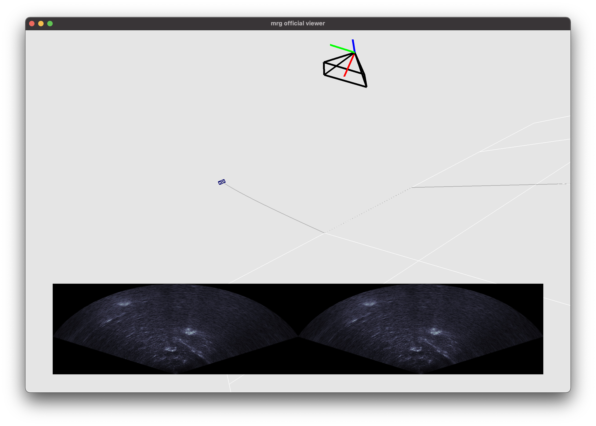
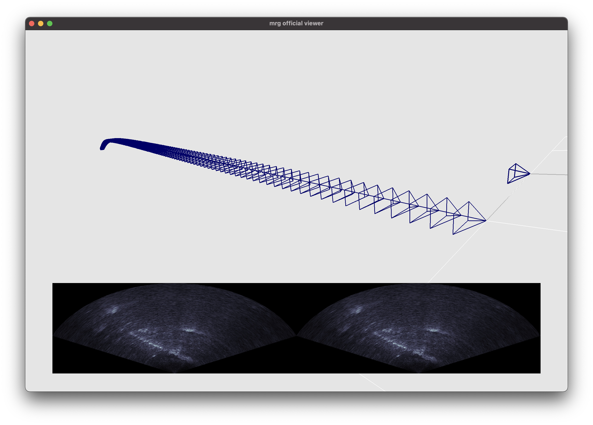
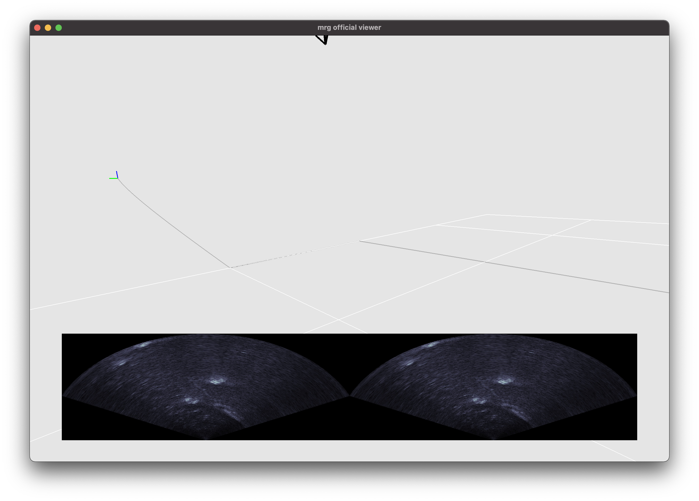
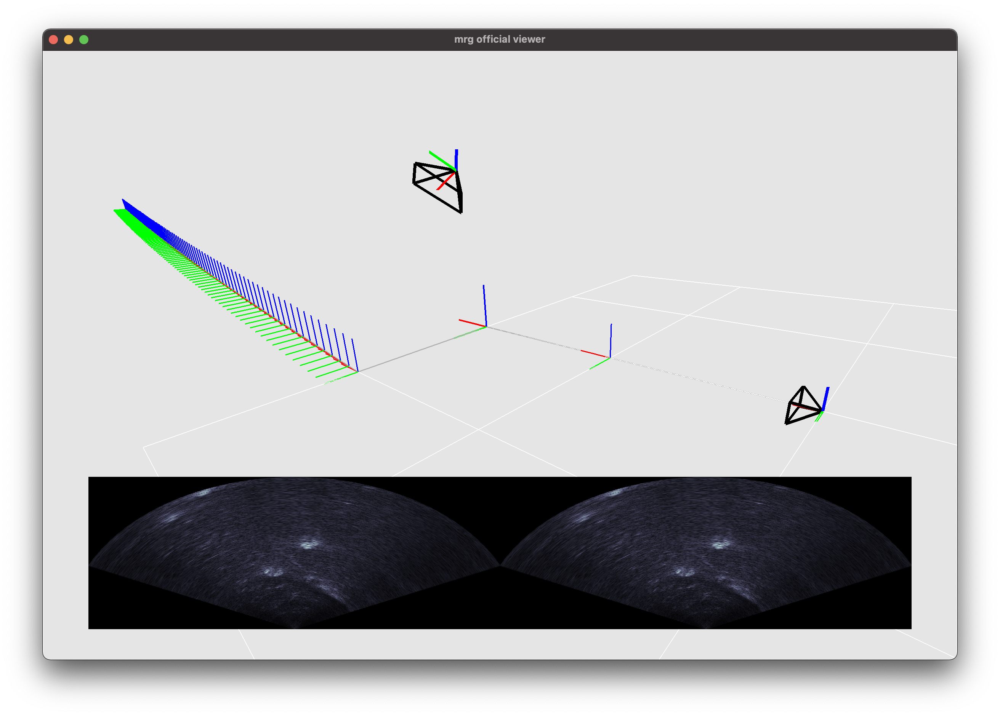

# `tonioviz` to the rescue

## Prerequisites

For the moment, make sure you install:
- [Pangolin](https://github.com/stevenlovegrove/Pangolin)
- [GTSAM](https://github.com/borglab/gtsam)

and let me know if it breaks...

Then just checkout the `examples/SimpleCheckout.cpp` exec and let me know if it
runs for you.

<!-- You can install the necessary dependencies by just running the -->
<!-- `install-dependencies.sh` script. This will install: -->

<!-- - Pangolin -->

<!-- In addition, you need to have the following: -->

<!-- - GTSAM (negociable if you guys think we should remove this dependency, should -->
<!--   be pretty easy to do) -->

## Examples

Here are some examples:

- GTSAM-based:

- Eigen-based:

- ROS-based:

### Drawing keyframes

The types of supported keyframes for drawing are:
- Frustums: `mrg::KeyframeDrawType::Frustum` (default),
- Triads: `mrg::KeyframeDrawType::kTriad`,
- Points: `mrg::KeyframeDrawType::kPoint`.

```cpp
  mrg::VisualizerParams params;
  params.kftype = mrg::KeyframeDrawType::kTriad;
  // Or
  params.kftype = mrg::KeyframeDrawType::kFrustum;
  // Or
  params.kftype = mrg::KeyframeDrawType::kPoint;
```

It is possible to switch between representations in real-time by pressing the
`k` key (for "keyframe").

Additionally, it is possible to choose to draw either only the most recent
keyframe, or the full keyframe history (default) by modifying the visualizer's
parameter `onlylatest`:

```cpp
  mrg::VisualizerParams params;
  params.onlylatest = true;  // Draws only the most recent one.
  params.onlylatest = true;  // Draws all of them (default).
```

This can also be dynamically modified during runtime by pressing the key `l`
(for "latest").

The size of the keyframe can be modified by the visualizer parameter
`frustum_scale`, which is in meters:

```cpp
  mrg::VisualizerParams params;
  params.frustum_scale = 0.1; // [m], default value.
```

|          | latest only                      | full history                   |
|----------|----------------------------------|--------------------------------|
| frustums |  |  |
| triads   |    |    |

## Troubleshooting

### `SimpleCheckout.cpp` data

Simple checkout was created with Kurran's Blue ROV data in mind, which you can
find in this
[link](https://drive.google.com/drive/folders/1c-FjAgZI91IUzn-MGl9Tl4CUMox31dPq).

### Filesystem

If you get an error regarding `filesystem` due to

```cpp
#include <filesystem>
```

and

```cpp
std::filesystem::exists(name)
```

from `/src/DataUtils.cpp`, in the `LoadImages` function, then you need to
upgrade your GCC compilers. An easy peasy way to do it is by following
[this](https://linuxize.com/post/how-to-install-gcc-compiler-on-ubuntu-18-04/)
guide.
